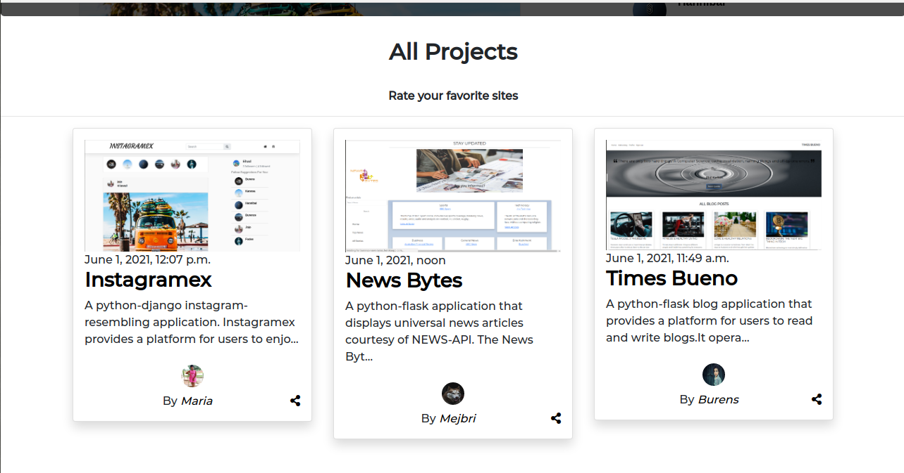

# awwwards
#### {A python-django awwwards website-resembling application}, {1-June-2021}
#### {By Burens Omondi}
## Description
{awwwards is a python-django application developed and designed to replicate the functionalities of the official awwwards application}

## Homepage/Timeline

## All projects in the homepage

## Single project search page

## Multiple projects search page

## Profile Page

## Project Page before rating

## Project after rating

## Setup/Installation
* Navigate to the project repository via https://github.com/Burence1/instagramex.git
* Change your working directory to the clone location of your preference.
* Use the git clone command in the terminal to clone the project to the preferred local machine directory.
* To work on the cloned project, ensure to have any text editors of your choice.}

{Additionally, all the required assets are available in the stated remote repository. All you need is a text editor of your choice}

## Behaviour Driven Development
## Features
* Users can register and get welcome emails 
* Users can update their profiles
* Users can upload projects
* Users can can rate their projects alongside other users' projects
* Users can view users who projects alongside their ratings
* Users can view projects posted by users in users' profile pages
* Users can view projects average/overall scores
* Users can search for projects

## Known Bugs
{Fortunately, the project has no known bugs}

## Technologies Used
{awwwards has been developed using a variety of technologies}

* Python
* Git
* Html
* Css
* Bootstrap
* fontsawesome
* django
* heroku
* Postgresql

## Support and Contact details
{Incase of any issues or need to contribute to the project, you can reach me via;
 * Tel: 0795591620
 * Email: burensomondi@gmail.com
 * LinkedIn: Burens Omondi
 * Github: Burence1}

## LICENSE

MIT License

Copyright (c) 2021 Burens Omondi

Permission is hereby granted, free of charge, to any person obtaining a copy
of this software and associated documentation files (the "Software"), to deal
in the Software without restriction, including without limitation the rights
to use, copy, modify, merge, publish, distribute, sublicense, and/or sell
copies of the Software, and to permit persons to whom the Software is
furnished to do so, subject to the following conditions:

The above copyright notice and this permission notice shall be included in all
copies or substantial portions of the Software.

THE SOFTWARE IS PROVIDED "AS IS", WITHOUT WARRANTY OF ANY KIND, EXPRESS OR
IMPLIED, INCLUDING BUT NOT LIMITED TO THE WARRANTIES OF MERCHANTABILITY,
FITNESS FOR A PARTICULAR PURPOSE AND NONINFRINGEMENT. IN NO EVENT SHALL THE
AUTHORS OR COPYRIGHT HOLDERS BE LIABLE FOR ANY CLAIM, DAMAGES OR OTHER
LIABILITY, WHETHER IN AN ACTION OF CONTRACT, TORT OR OTHERWISE, ARISING FROM,
OUT OF OR IN CONNECTION WITH THE SOFTWARE OR THE USE OR OTHER DEALINGS IN THE
SOFTWARE.